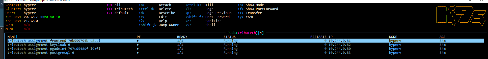
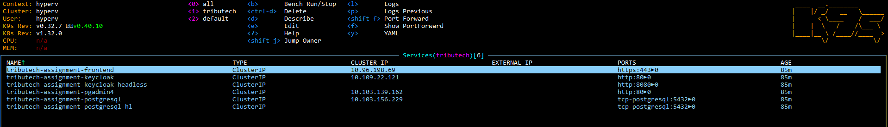
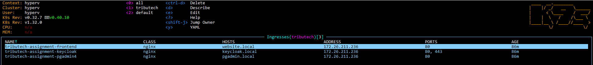
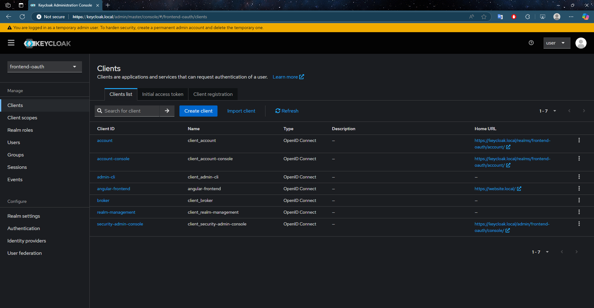
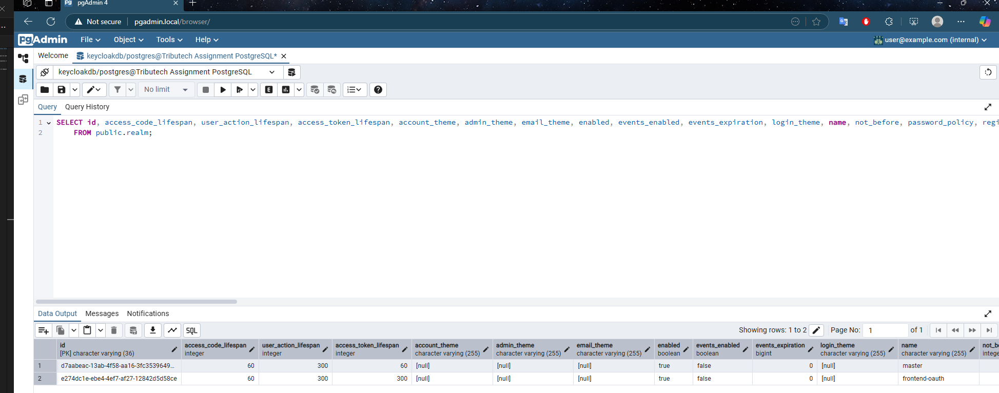
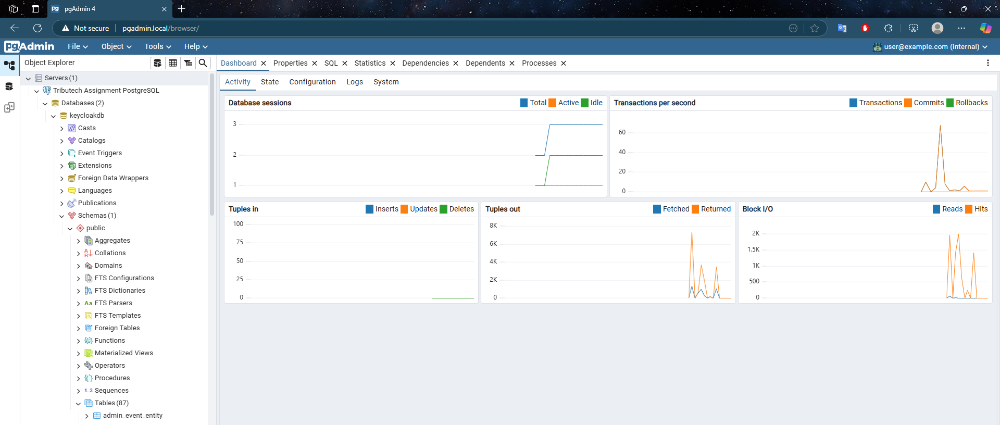
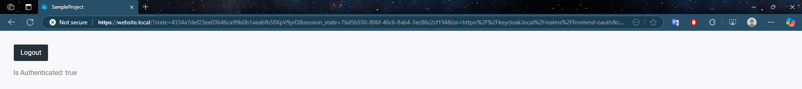

# Concept and Design:
- I started by outlining the base umbrella helm chart which just listed its dependencies to get an overview of the flow and then started focusing on the frontend chart as it was the only chart 100% necessary to create myself.
- During this process, I decided it would be best to work on automating the deployment and testing of the chart somehow before going too deep into manual steps.
- I started with GitHub Actions but decided it would be an extra effort which was not directly required so I opted for a simple bash script which I could run from my local Ubuntu WSL instance. I also looked into setting up some kind of git commit webhook so it would automatically test everything on commit but decided not to spend time on it given my time was limited.
- After getting an MVP chart packaged and installed on the cluster, I looked in more detail if there were any other charts I should include such as the nginx ingress controller.
- I concluded that it didn't make sense to have this included as it was available out of the box as an addon in minikube and it was outlined in the assignment specification that it could be assumed that it already existed in the cluster.

## Describe how the components interact and are configured.
- The main chart contains only minor logic, it seemed like the most logical place to generate the config map containing the Keycloak realm to be imported but other than that it just contains the subchart dependencies and values to be passed to helm install.
- The Postgres database is required for all other components to function correctly as it is required by:
    - **PGAdmin:** During the container startup when it attempts to add the server details and connect.
    - **Keycloak:** During startup the Keycloak instance waits for a connection to the database.
    - **Website:** During the login the website requires Keycloak to be ready so also depends on Postgres in that sense.

# Testing Instructions:

Follow these steps to set up and test the Helm chart locally, it should be noted these steps apply specifically to Windows:

1. **Setting up the local Kubernetes environment:**
    - Download minikube by running this command in PowerShell:
    ```powershell
    New-Item -Path 'c:\' -Name 'minikube' -ItemType Directory -Force
    Invoke-WebRequest -OutFile 'c:\minikube\minikube.exe' -Uri 'https://github.com/kubernetes/minikube/releases/latest/download/minikube-windows-amd64.exe' -UseBasicParsing
    ```
    - Add the minikube binary to the path:
    ```powershell
    $oldPath = [Environment]::GetEnvironmentVariable('Path', [EnvironmentVariableTarget]::Machine)
    if ($oldPath.Split(';') -notcontains 'C:\minikube'){
    [Environment]::SetEnvironmentVariable('Path', $('{0};C:\minikube' -f $oldPath), [EnvironmentVariableTarget]::Machine)
    }
    ```
    - Close and reopen the terminal before proceeding.
    - Set MINIKUBE_HOME env variable if you wish to choose the location of the cluster files.
    - Start minikube with a preferred driver, I had the best experience with Hyper-V:
    ```powershell
    minikube start --driver hyperv
    ```
    - List available addons:
    ```powershell
    minikube addons list
    ```
    - Enable addon ingress & ingress-dns:
    ```powershell
    minikube addons enable ingress
    minikube addons enable ingress-dns
    ```
    - Other useful addons include metrics-server & dashboard for monitoring the system:
    ```powershell
    minikube addons enable metrics-server
    minikube addons enable dashboard
    ```

2. **Deploying the Helm chart:**
    - There is a script in this repository that will package and install the helm chart. It is located under tools -> build.local.sh.
    - Alternatively, here are step-by-step instructions:
    - Download and install the helm CLI: https://helm.sh/docs/intro/install/
    - Edit the values.yaml file as required, one assumption made is that the frontend docker image is built and hosted in a reachable registry, the registry and repository are then possible to configure via the values.yaml file.
    - Another assumption made is that the namespace used is tributech so if the chart is installed to another namespace the postgres hostname would need to be changed.
    - Once the values are set as required the chart can be packaged and installed using the commands:
    ```bash
    helm package "$path_to_chart_directory" -u
    helm install tributech-assignment "$path_to_chart_file" --namespace tributech -f values.yaml --create-namespace
    ```

3. **Validating each component:**
    - **PostgreSQL:** Connect to the PostgreSQL instance using a client like `psql` or pgadmin with the secret value generated by the chart and username postgres.
    - **PGAdmin:** Access PGAdmin at `http://pgadmin.local` and ensure that it contains the pre-defined postgres server connection and can connect.
    - **Keycloak:** Access the Keycloak admin console at `http://keycloak.local` and log in with the admin credentials. Ensure that the realm frontend-oauth exists and the client angular-frontend also exists.
    - **Website:** Access the website at `http://website.local` and verify that the login flow works correctly with Keycloak.

# Testing in Our Infrastructure:

To deploy the Helm chart to our Kubernetes infrastructure, follow these steps:

## **Prerequisites:**
    - Ensure an Ingress controller is installed and configured.
    - Overwrite the default values.yaml, in particular:
        - keycloak.externalDatabase.host
        - pgadmin4.serverDefinitions.servers.firstServer.Host
        - frontend.image.repository
        - frontend.ImagePullSecrets

## **Install**
    - Package and install the chart using: 
    ```bash
    helm package /helm-chart -u
    helm install tributech-assignment "$path_to_chart_file" --namespace tributech -f values.yaml --create-namespace
    ```

# Screenshots of running system
## Pods


## Services


## Ingress


## Keycloak


## PgAdmin



## Website
